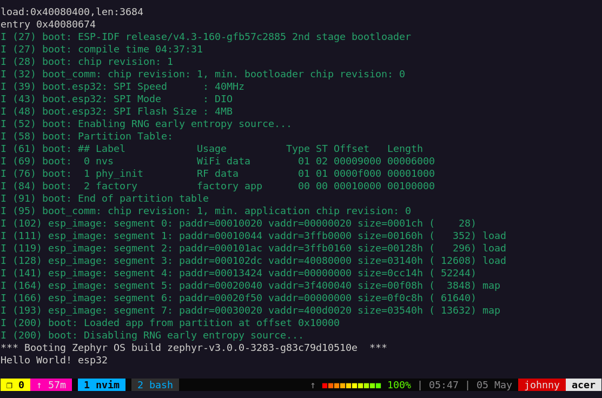
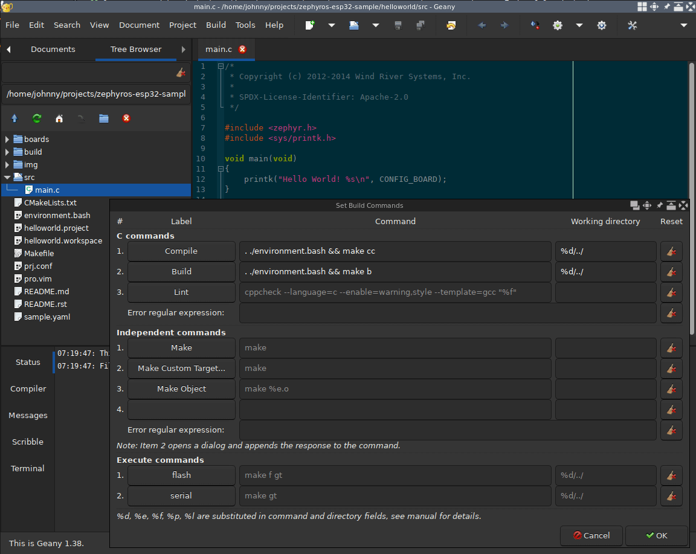
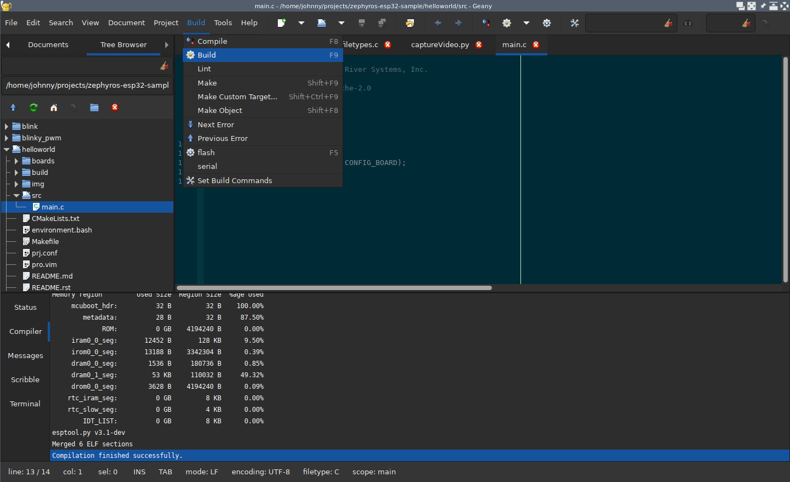
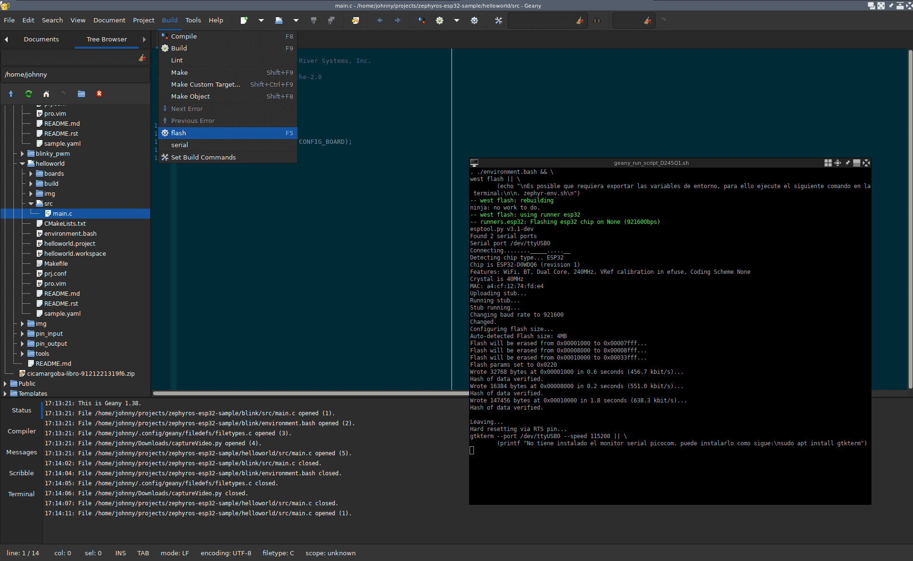
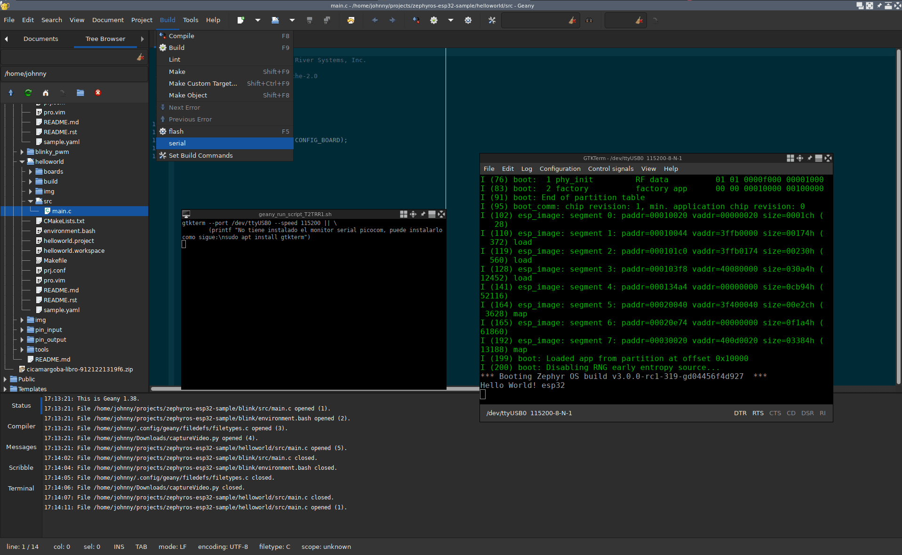
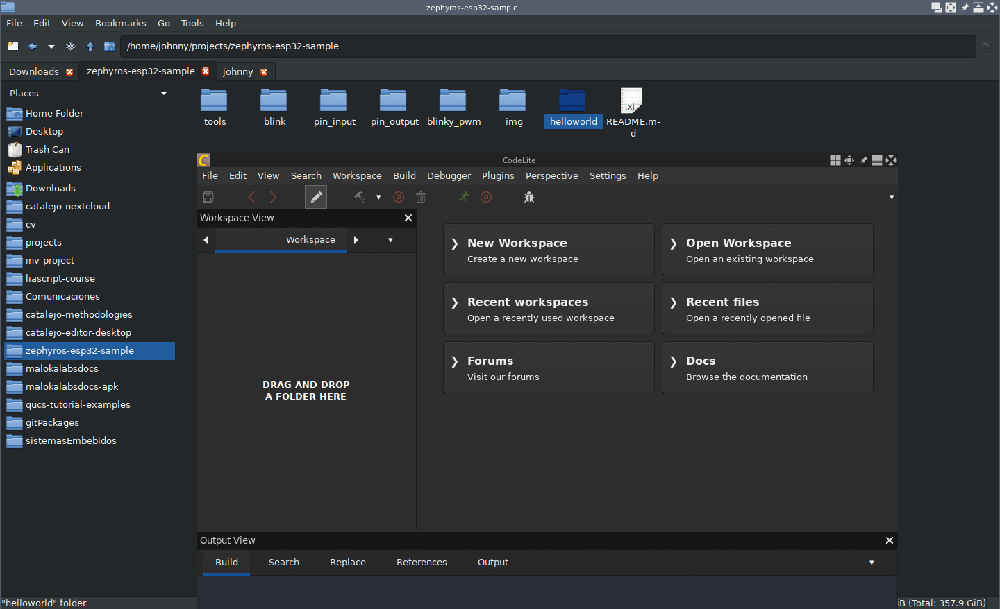
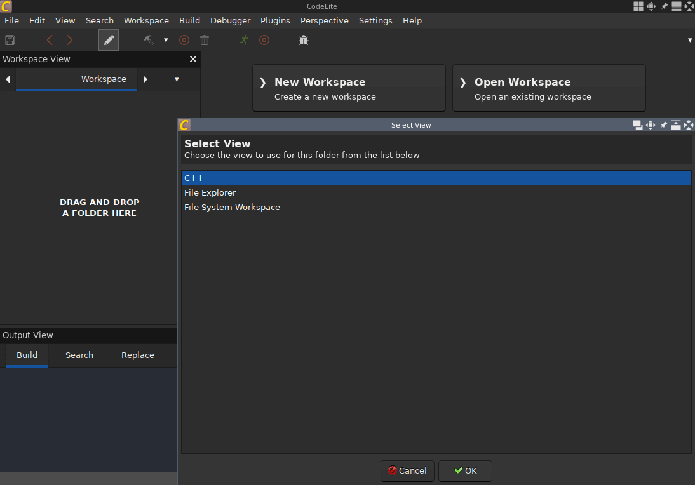
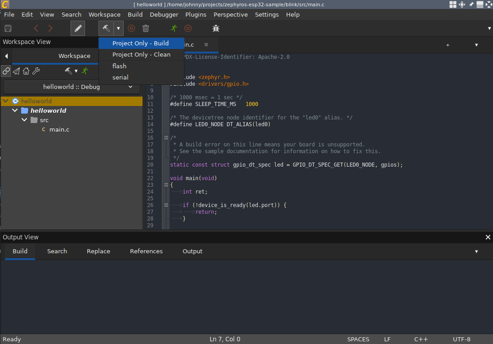

<!-- vim-markdown-toc GitLab -->

* [ZephyrOS-esp32-example](#zephyros-esp32-example)
  * [1. Instalación de Zephyr O.S. con soporte para el esp32](#1-instalación-de-zephyr-os-con-soporte-para-el-esp32)
    * [1.1 Instalar Zephyr O.S.](#11-instalar-zephyr-os)
    * [1.2 Crear enlace simbólico del SDK de Zephyr O.S.](#12-crear-enlace-simbólico-del-sdk-de-zephyr-os)
    * [1.3 Instalar soporte de zephyr para esp32](#13-instalar-soporte-de-zephyr-para-esp32)
  * [2. Instalación de herramientas para comunicación serial entre PC y esp32](#2-instalación-de-herramientas-para-comunicación-serial-entre-pc-y-esp32)
  * [3. Construyendo y programando un ejemplo en el esp32](#3-construyendo-y-programando-un-ejemplo-en-el-esp32)
    * [3.1 Helloworld desde TERMINAL](#31-helloworld-desde-terminal)
      * [3.1.1 Construir y flashear](#311-construir-y-flashear)
      * [3.1.2 Ver el resultado por terminal](#312-ver-el-resultado-por-terminal)
    * [3.2 Helloworld desde GEANY](#32-helloworld-desde-geany)
      * [3.2.1 Configurando Geany](#321-configurando-geany)
      * [3.2.2 Construyendo el helloworld desde Geany](#322-construyendo-el-helloworld-desde-geany)
      * [3.2.3 Flashear esp32](#323-flashear-esp32)
      * [3.2.4 Monitorear por puerto serial](#324-monitorear-por-puerto-serial)
    * [3.3 Helloworld desde Codelite](#33-helloworld-desde-codelite)
      * [3.3.1 Construir, flashear y monitorear un ejemplo en el esp32](#331-construir-flashear-y-monitorear-un-ejemplo-en-el-esp32)
      * [3.3.2 Configurar Codelite para un nuevo ejemplo](#332-configurar-codelite-para-un-nuevo-ejemplo)
  * [Referencias](#referencias)

<!-- vim-markdown-toc -->

# ZephyrOS-esp32-example

## 1. Instalación de Zephyr O.S. con soporte para el esp32

### 1.1 Instalar Zephyr O.S.

Para instalar *Zephyr O.S.* en distribuciones basadas en debian (Mint, Ubuntu) seguir los
pasos de la página oficial de zephyr (Usar el modo **Install globally** en la sección *Get Zephyr and install Python dependencies*).

[Página oficial de Zephyr O.S.](https://docs.zephyrproject.org/latest/develop/getting_started/index.html#getting-started-guide)

### 1.2 Crear enlace simbólico del SDK de Zephyr O.S.

Crear un enlace simbólico del sdk instalado, por ejemplo, si se instaló el *SDK* de zephyr en el
home del computador en su versión *0.15.0* se crea el enlace simbólico como sigue:

```bash
ln -sr ~/zephyr-sdk-0.15.0 ~/zephyr-sdk
```

### 1.3 Instalar soporte de zephyr para esp32

Escoger un directorio en el PC y clonar este repositorio, ejemplo:

```bash
mkdir -p ~/projects/ && ~/projects/
git clone https://gitlab.com/johnnycubides/zephyros-esp32-sample.git
```

Es hora de instalar el soporte del SDK para el esp32, para tal fin se hace lo siguiente:

```bash
cd zephyros-esp32-sample/helloworld
. environment.bash
make west-espressif
```

## 2. Instalación de herramientas para comunicación serial entre PC y esp32

Instalar las herramientas para el monitor serial (debug y flasheo del esp32).

```bash
sudo apt install picocom minicom gtkterm
```

Dar permisos al grupo *dialout* a su usuario linux, ejemplo de comando:

```bash
sudo usermod -a -G dialout user_name
```
**Observaciones**:

* En el anterior comando *user_name* debe ser reemplazado por su nombre de usuario, sino lo conoce puede ejecutar el comando `whoami` el cual le devolverá su nombre de usuario.

* Para que el anterior comando funcione deberá reiniciar el PC; después del reinicio, podrá verificar ejecutando el comando `groups`, allí deberá observar el grupo dialout, ejemplo:

  ```bash
  ~/projects  $  groups 
  johnny dialout cdrom floppy audio dip video plugdev netdev bluetooth lpadmin scanner
  ```

## 3. Construyendo y programando un ejemplo en el esp32

### 3.1 Helloworld desde TERMINAL

#### 3.1.1 Construir y flashear

Seleccione uno de los ejemplos que están en este repositorio y ejecute en consola el comando
`make b` para construir, ejemplo:

```bash
cd helloworld
make b
```

Con el esp32 conectado al PC por USB proceda a programar la memoria flash del esp32 para
subir el programa con el siguiente comando:

```bash
make f
```

> Si el proceso de flasheo no inicia, oprima en la placa del esp32 el botón de **boot**

Puede ejecutar la anterior secuencia de comandos en una sola instrucción como sigue:
```bash
make b f
```

#### 3.1.2 Ver el resultado por terminal

Ejecute en la terminal el siguiente comando que abrirá un monitor en picocom; se recomienda
investigar los comandos para usar picocom.

```bash
make t
```

> Para salir de picocom oprima `Ctrl + a` y luego `Ctrl + x`

En la placa de desarrollo oprima el botón de reiniciar y observe el resultado
en el monitor serial.

Ejemplo de resultado:



**Observaciones**:

* Observe que en los comandos se hace uso de *make* para ver que otros comandos fueron planteados ejecute el comando `make help`. Para aprender más sobre *make* se invita a revisar su documentación.
* Puede ejecutar `make b f t` si quiere realizar el proceso de construcción, flasheo y monitoreo por serial en un solo comando.

### 3.2 Helloworld desde GEANY

Geany es un editor de texto gráfico ligero que tiene lo necesario para construir proyectos con Zephyr O.S. además de ser opensource.

#### 3.2.1 Configurando Geany

Primero deberá **instalar Geany** con los plugings ofrecidos por la comunidad; para activar los plugins en geany deberá hacerlo desde la
barra de herramientas en la categoría `Tools -> Plugin Manager`.

Comando de instalación de Geany con los plugins:

```bash
sudo apt install geany geany-plugins
```

Instalado Geany y sus plugins se requiere **configurar las herramientas de construcción de Geany**, para eso remplace el
contenido del archivo `filetypes.c` que encontrará en `Tools -> Configuration Files -> Filetype Configuration -> Programming Languages -> filetypes.c`
por la siguiente configuración:

```bash
[build-menu]
EX_00_LB=Flash
EX_00_CM=make f gt
EX_00_WD=%d/../
EX_01_LB=Serial
EX_01_CM=make gt
EX_01_WD=%d/../
NF_00_LB=_Make flash
NF_00_CM=. ./enviroment.bash && make f
NF_00_WD=%d/../
NF_01_LB=Make Custom _Target...
NF_01_CM=. ./environment.bash && make 
NF_01_WD=%d/../
FT_00_LB=_Compile
FT_00_CM=. ./environment.bash && make cc
FT_00_WD=%d/../
FT_01_LB=_Build
FT_01_CM=. ./environment.bash && make b
FT_01_WD=%d/../
```

La configuración realizada será visualizada`Build -> Set Build Commands` siempre y cuando tenga un archivo.c en el área de trabajo, ejemplo:



#### 3.2.2 Construyendo el helloworld desde Geany

Apoyado en la siguiente imagen realice los siguientes pasos:

1. Abra el archivo `src/main.c` del proyecto a compilar, por ejemplo, como se ve en la imagen se abre el proyecto `helloworld/src/main.c`
2. Ubique el icono de **Build** (F9) que se encuentra en `Build -> Build` o en la misma barra de herramientas y oprímalo,
Geany iniciará el proceso de chequeo de los archivos fuente, compilación y enlace del proyecto
3. El proceso y estado de la construcción se verá en la sección `Compiler` que es una pestaña debajo de Status, allí
también encontrará el reporte de errores que al dar clic en ellos lo llevará al sitio en el código que generó el error



#### 3.2.3 Flashear esp32

`Build -> Flash`



#### 3.2.4 Monitorear por puerto serial

`Build -> Serial` 



### 3.3 Helloworld desde Codelite

```bash
sudo apt install codelite
```

#### 3.3.1 Construir, flashear y monitorear un ejemplo en el esp32







#### 3.3.2 Configurar Codelite para un nuevo ejemplo

## Referencias

https://www.zephyrproject.org/zephyr-rtos-on-esp32/


